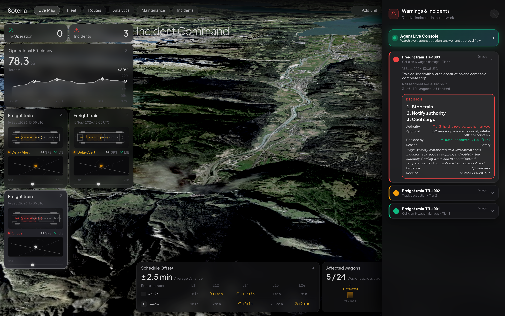
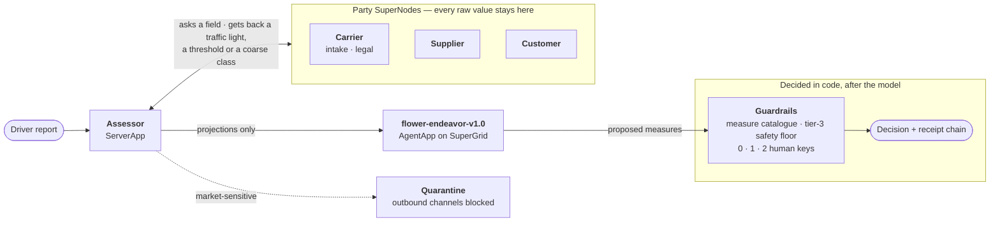
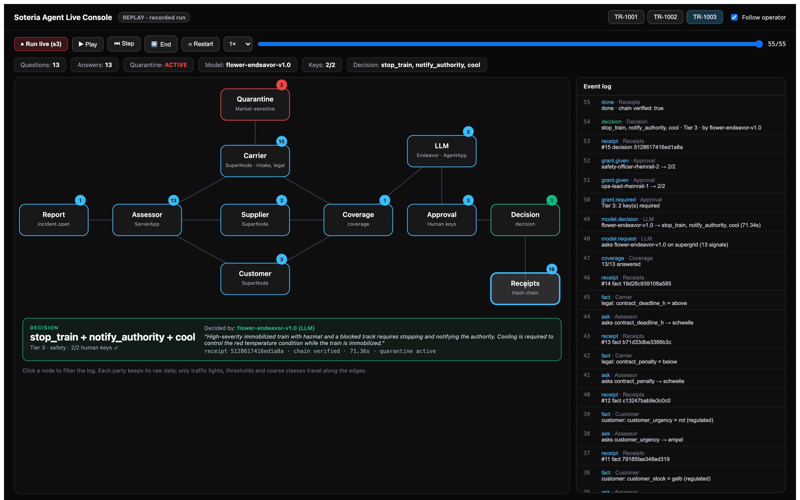

<div align="center">

# Soteria

**A freight incident, decided in minutes — without any party learning more than it may.**


[](https://flower.ai)
[](#who-decides-what)
[](#run-it-yourself)
[](LICENSE)

</div>



> **3rd place** at the **Collaborative Agent Hackathon** hosted by Flower Labs — Impact Hub
> Berlin, 16 September 2026. The brief: *build an open-source agent system with Flower in which
> the safe collaboration of agent teams is central.* Judged on impact, innovation, use of Flower,
> technical execution, demo, and **safety and oversight**.
>
> Everything in the pictures was built on the day. The LLM assessor and the live bridge landed in
> the last hour before the demos and the evening after them.

---

## The situation

A freight train hits an obstruction. A hazmat wagon is damaged, residential buildings stand
300 metres away, and the train carries precursors a plant is waiting for.

Today this gets decided by a phone chain of operator, supplier, customer and contracts
department — and at the end a group chat holds everything no single party should ever have
learned: the customer's stock levels, the contract penalties, the weak spots of the line. For an
incident this size, that is market-sensitive information.

**Soteria decides in minutes, and no party learns more than it may.** Every party runs its own
Flower node and keeps its own data. The assessor asks field by field and receives traffic lights
and thresholds instead of numbers. Measures are tiered by how hard they are to reverse, a train
is only stopped when two different humans approve it, and every answer goes into a chained
receipt.

## How a decision happens



<details>
<summary>Text version of the diagram</summary>

```
                    SuperLink
                        │
   ServerApp  assessor  │  query.ask_fields, the whole ask plan in one message per node
                        │
        ┌───────────────┼────────────────┐
        ▼               ▼                ▼
   SuperNode        SuperNode        SuperNode
   carrier          supplier         customer
   intake +         replacement,     stock, urgency,
   contract agent,  cooling needs    contact persons
   line, surroundings
```

</details>

The parties come from the case file, not from the code: one more customer is one more entry.

## Watch it happen

The **Agent Live Console** opens from the dashboard. It shows the flow from the report through
the three party nodes to the model, the human approvals and the receipt chain — with the event
log next to it. **Run live** starts a real run on the federation and streams the events while
they happen; without the bridge it replays recorded runs and says so.



## The claim, and how to check it

> **No raw value reaches a role that may not have it.**

```shell
uv run python scripts/wire_proof.py
```

The script has every role ask every other node for every field — including the ones it should
never ask for — and searches the answers for the raw values. Across three cases:

| boundary crossings | refused | authorised raw disclosure | violations |
|---:|---:|---:|---:|
| 234 | 96 | 81 | **0** |

The middle column is the denominator. A test that only reports "0 leaks" says nothing; this one
reports how much disclosure the matrix *allows* and only checks where it does not. The first
version had no denominator — and reported authorised disclosure as a leak. With the denominator
it then found two real bugs, which are fixed (see the git history).

Three bolts work independently of each other:

1. **The node does not have it.** Every node loads only its own party's data. Another customer's
   contract does not exist in memory there.
2. **The matrix projects.** The assessor learns *that* stock is low, never *how* low.
3. **The transport carries only scalars.** Flower's `ConfigRecord` does not hold objects. A raw
   record cannot be sent, even if the matrix were misconfigured.

### The need-to-know matrix is data

[`data/schema/field_catalogue.json`](data/schema/field_catalogue.json) defines who sees which
field at which resolution. `soteria/matrix.py` loads and validates the file on import; a broken
catalogue never reaches a run. A new field is a JSON entry, not a code change. Table:
[`docs/MATRIX.md`](docs/MATRIX.md). How-to: [`data/schema/README.md`](data/schema/README.md).

The **matrix protects fields, the federation protects rows**: both contracting parties see a
contract, but customer 2 never loads contract 1.

## Who decides what

The measures are chosen by a language model. Everything that must not depend on a model is code.

| | Decided by `flower-endeavor-v1.0` | Enforced by code |
|---|---|---|
| Which measures to take | ✅ from projections only — traffic lights, thresholds, flags, coarse classes | measures outside the catalogue are rejected |
| How binding the decision is | — | tier 1/2/3 by reversibility, derived from the measures |
| Whether it may be executed | — | 0, 1 or 2 human keys, bound to the incident parameters |
| What the parties reveal | — | the need-to-know matrix, before anything is sent |
| Market-sensitive information | — | quarantine blocks every outbound channel |
| Proof afterwards | — | hash-chained receipts across the whole incident |

The model runs as a **separate Flower AgentApp on SuperGrid** ([`agent/`](agent/)), because an
`agentapp` component in the federation bundle would switch the ServerApp off. If it drops a
tier-3 measure the rule policy requires, the floor puts it back and the event says so. If
SuperGrid is unreachable, the rule policy decides alone and every event says
`decided_by = "policy_fallback"` — a fallback is never labelled as model output.

Published on Flower Hub as `kaiser-data/soteria` and `kaiser-data/soteria-assessor-agent`.

## The four numbers

```shell
uv run python scripts/bench.py
```

| | |
|---|---|
| **Time** | logic ~5 ms · real federation 3-6 s per incident · **with the model call 50-90 s** · phone-chain baseline 47 min — **an assumption, not a measurement** |
| **Hits** | s1 matches the stored answer; in s2 and s3 the model adds reversible measures on top · **no holdout cases, ground truth unconfirmed** |
| **Tightness** | 234 crossings, 96 refused, 81 authorised, 0 violations |
| **Gap** | 3/3 cases decided although the customer is silent |

## The three cases

| Case | Situation | Decision | Tier |
|---|---|---|---|
| s1 | Small obstruction, refrigeration unit on a fresh-goods wagon | `cool` | 1 — autonomous |
| s2 | Track blocked, hospital supplies on board | `alt_transport` | 2 — one key |
| s3 | Impact, hazmat wagon damaged, residential buildings 300 m away | `stop_train`, `notify_authority` | 3 — two keys, quarantine |

The tier and the keys are decided by code. The measures come from the model, which in s2 and s3
adds a reversible measure (`cool`, `hold`) to the stored answer above.

## Run it yourself

```shell
uv sync
uv run pytest -q                            # 188 passed, 1 skipped
uv run python scripts/validate_data.py      # check the data tree
uv run python scripts/wire_proof.py         # the boundary proof, no network
uv run python scripts/bench.py              # the four numbers
uv run python scripts/record_run.py --all   # event streams for the views

./scripts/federation.sh up s3               # SuperLink + three party nodes
./scripts/federation.sh run s3              # the incident over real messages
./scripts/federation.sh down
```

The dashboard, the console and a live run:

```shell
uv run python scripts/bridge.py             # live bridge on 127.0.0.1:8765
cd "Soteria - Frontend" && npm install && npm run dev
```

Open http://localhost:5173 for the dashboard, then the **Agent Live Console** button in the
incident sidebar. **Run live** needs the bridge and a valid `flwr login supergrid`, because the
assessor calls the model on SuperGrid.

`Soteria - Frontend/.env.local` needs a Mapbox token for the map:

```
VITE_MAPBOX_ACCESS_TOKEN=pk....
```

`~/.flwr/config.toml` needs:

```toml
[superlink.carrier-fed]
address = "127.0.0.1:8000"
insecure = true
```

## Real versus simulated

| Claim | Real | Not real |
|---|---|---|
| No raw value reaches a role that may not have it | 234 crossings measured, with a denominator | — |
| Three parties, three nodes | three SuperNodes, real Flower messages, all three cases decided | all three run on **one** machine |
| One federation per party | one federation with three party nodes | a ServerApp cannot reach three SuperLinks together — **next stage** |
| Agent team | one assessor as a ServerApp, parties as ClientApps, the reasoning as an AgentApp | — |
| The decision is made by an LLM | `flower-endeavor-v1.0` picks the measures from projections only | the guardrails are code, not the model |
| Hit rate | s1 matches the stored answer; in s2 and s3 the model adds reversible measures, which the benchmark counts as a **mismatch** | rules and stored answers written against exactly these cases; ground truth **not confirmed**; **no holdout** |
| Minutes instead of a phone chain | logic and federation measured | the 47 min baseline is an **assumption** |
| Data | schema, validation | **all invented** — no real railway data, people or companies |
| Receipts | chain across the whole incident, verifiable | 16 hex characters, a checksum, not cryptography for real emergencies |
| Operator dashboard | incidents, decisions, agent flow come from the event stream | map, fleet cards and bottom metrics are mock |

What has not been checked: [`docs/RISKS.md`](docs/RISKS.md).

## Repo layout

```
soteria/              the engine
  assessor_app.py       ServerApp: asks the nodes, decides, records receipts
  party_app.py          ClientApp: answers only what the matrix allows
  llm.py                the model call and its guardrails
  matrix.py             need-to-know projections, loaded from the catalogue
  policy.py             the rule engine: safety floor and fallback
  grants.py             tiers and human keys
  ledger.py             budget, taint, quarantine, audit trail
  receipts.py           the hash chain
agent/                the reasoning AgentApp — a separate Flower bundle for SuperGrid
data/                 parties, contracts, network, cases, field catalogue
scripts/              bench · wire_proof · record_run · federation.sh · bridge.py · export_frontend.py
Soteria - Frontend/   operator dashboard and Agent Live Console (Vite + React)
view/fixtures/        recorded event streams of real runs
docs/                 matrix, event contract, risks
```

## Documents

| | |
|---|---|
| Need-to-know matrix | [`docs/MATRIX.md`](docs/MATRIX.md) |
| Changing the data schema | [`data/schema/README.md`](data/schema/README.md) |
| Event contract for the views | [`docs/EVENTS.md`](docs/EVENTS.md) |
| Measurements, platform findings, open issues | [`docs/RISKS.md`](docs/RISKS.md) |
| Build plan (historical, German) | [`docs/superpowers/plans/2026-09-16-soteria.md`](docs/superpowers/plans/2026-09-16-soteria.md) |

## License

Apache 2.0, see [LICENSE](LICENSE). Built with [Flower](https://flower.ai); thanks to Flower Labs
for hosting the hackathon.
